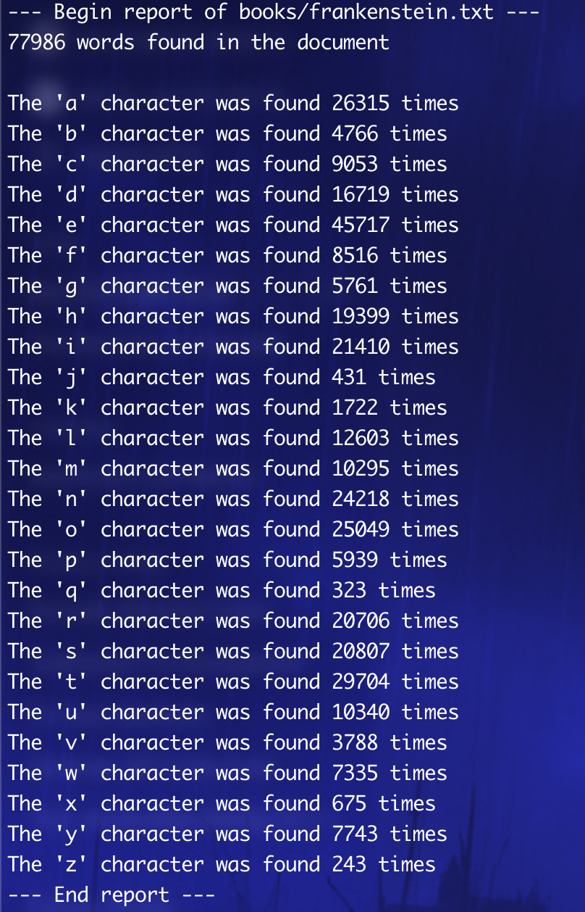

# bookbot

Bookbot is the first guided project from [Boot.dev](https://boot.dev).

Bookbot runs through the entire text of a book (Frankenstein, in our case) and returns a report of the word count in the book and a count of each alpha (a-z) character.

